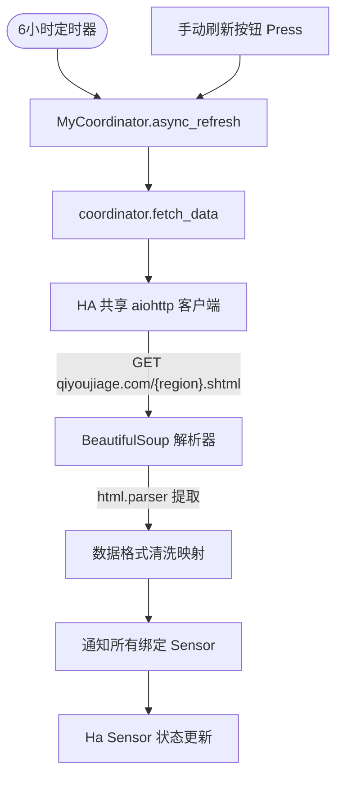

# Oil Price Home Assistant Custom Component Architecture (油价插件架构文档)

## 1. 概述
本项目是一个基于 Home Assistant 自定义组件（Custom Component）架构开发的国内今日油价和油价调整趋势的数据集成插件。它通过异步爬取和解析 `qiyoujiage.com` 的实时页面，为 Home Assistant 自动注册各标号汽柴油价格及变动预测的传感器实体。

## 2. 核心架构与核心设计原则
- **数据共享协同（DataUpdateCoordinator）**: 整个插件共享单一的数据更新协调器 `MyCoordinator`。所有传感器不单独发起 HTTP 请求，而是绑定到同一个协调器。协调器每 6 小时触发一次数据请求，保证数据一致性的同时极大地减少了对目标网站的访问压力。
- **高鲁棒性解析器 (Robust Parser)**: 网页爬虫解析逻辑采用高阶容错设计，在部分 DOM 节点排版改变时会降级提示，而绝对不让整个数据抓取或同步链路中断抛错。
- **共享连接池**: 使用 Home Assistant 全局共享的高性能 HTTP 客户端会话连接池（`aiohttp_client.async_get_clientsession`），避免频繁创建和关闭 Socket 连接。
- **零编译安装（树莓派友好）**: 解析引擎采用 Python 原生、免编译的 `html.parser` 驱动，完全兼容并适配树莓派（ARM 架构）等轻量级智能家居网关设备。

## 3. 目录与职责划分
```text
/home/hermes/projects/oilprice/
├── custom_components/oilprice/
│   ├── __init__.py           # 插件配置项入口，管理集成（ConfigEntry）生命周期、注册平台
│   ├── manifest.json         # 插件配置清单，定义元数据、版本及 beautifulsoup4 依赖项
│   ├── config_flow.py        # 用户 UI 配置流管理，定义区域选择表单
│   ├── coordinator.py        # 核心数据同步协调器，执行异步抓取、DOM 解析与全局异常退避
│   ├── sensor.py             # 动态生成并挂载各型油价、下次调整时间、跌涨提示等传感器实体
│   ├── button.py             # 注册“手动刷新（Refresh）”按钮，触发协调器刷新
│   └── translations/
│       └── zh-Hans.json      # 中文界面翻译描述配置文件
├── .gitignore                # 忽略编译缓存和本地临时文件
└── ARCHITECTURE.md           # 本系统架构说明文档
```

## 4. 核心工作与更新数据流 (Data Flow)



## 5. 连接恢复与异常退让机制
- **超时保护**: 网页抓取限制最长 15 秒超时（`asyncio.timeout(15)`）。
- **UpdateFailed 状态传导**: 凡遇网络波动、请求失败或超时，协调器统一向上级抛出 `UpdateFailed` 异常。此时 Home Assistant 框架会自动将实体设为“不可用（Unavailable）”，并启动框架内置的指数退让重试机制，免去了循环请求爆破的隐患。
